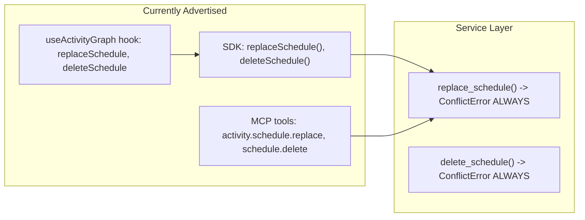
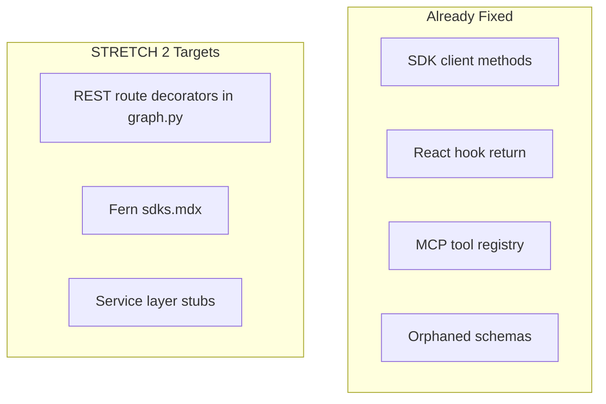

# Issue #23: Stop advertising unsupported schedule mutations in SDK and MCP

## Context

The service layer (`ActivityGraphService`) explicitly rejects `replace_schedule()` and `delete_schedule()` with `ConflictError` because schedule edges are derived from `startDate`. However, three public surfaces still advertise these operations as if they work:




The REST routes (`PUT /v1/activities/{id}/schedule`, `DELETE /v1/schedules/{id}/{id}`) remain in place per the issue scope -- this is SDK/MCP contract cleanup only.

---

## Commit strategy

Four separate commits, one per section. Do not move to the next section until the validation checklist passes.

1. **CORE commit:** `fix: remove unsupported schedule mutations from SDK and MCP`
2. **ADDITIONAL commit:** `test: add coverage for schedule mutation removal`
3. **STRETCH commit:** `chore: remove dead MCP schedule schemas`
4. **STRETCH 2 commit:** `docs: annotate unsupported schedule routes and service stubs`

---

## Pre-flight

**C0. Grep entire repo for all schedule mutation references**

Before making changes, run a full repo grep for `replaceSchedule`, `deleteSchedule`, `schedule.replace`, `schedule.delete` to identify any references in docs (`fern/`, `contributing-docs/`), or other files beyond the four main targets. This prevents missing straggler references.

---

## Goals

### CORE (must complete)

These are the explicit acceptance criteria from issue #23.

**C1. Remove `replaceSchedule()` and `deleteSchedule()` from `Move37Client`**

- File: [src/move37/sdk/node/src/client.js](src/move37/sdk/node/src/client.js)
- Remove the `replaceSchedule` and `deleteSchedule` methods (lines 165-186)

**C2. Remove `replaceSchedule` and `deleteSchedule` from the `useActivityGraph` hook return**

- File: [src/move37/sdk/node/src/hooks/useActivityGraph.js](src/move37/sdk/node/src/hooks/useActivityGraph.js)
- Remove the two entries from the returned object (lines 103-108)

**C3. Remove `activity.schedule.replace` and `schedule.delete` from `McpToolRegistry`**

- File: [src/move37/api/tool_registry.py](src/move37/api/tool_registry.py)
- Remove the two `ToolDefinition` entries (lines 50-54, 56)
- Remove the two handler entries from `_handlers` dict (lines 78, 80)
- Remove the two handler methods `_handle_activity_schedule_replace` (lines 196-204) and `_handle_schedule_delete` (lines 216-224)

**C4. Validate and commit**

- Run the CORE validation checklist (below)
- Commit: `fix: remove unsupported schedule mutations from SDK and MCP`

Pitfalls:

- No existing Python tests reference `schedule.replace` or `schedule.delete`, so no breakage expected there.
- No existing SDK tests reference `replaceSchedule` or `deleteSchedule`, so no breakage expected there.
- The web app does NOT call `replaceSchedule` or `deleteSchedule` (confirmed via grep), so the build will not break.

### ADDITIONAL (should complete)

**A1. Add SDK test proving `replaceSchedule` and `deleteSchedule` are no longer on the client**

- File: [src/move37/sdk/node/src/client.test.js](src/move37/sdk/node/src/client.test.js)
- Add a test asserting `client.replaceSchedule` is `undefined`
- Add a test asserting `client.deleteSchedule` is `undefined`

**A2. Add hook test proving `replaceSchedule` and `deleteSchedule` are no longer in the hook return**

- File: [src/move37/sdk/node/src/hooks/useActivityGraph.test.jsx](src/move37/sdk/node/src/hooks/useActivityGraph.test.jsx)
- Add a test asserting the hook result does not expose `replaceSchedule` or `deleteSchedule`

**A3. Add Python test proving MCP `tools/list` no longer includes the removed tools**

- File: [src/move37/tests/test_api.py](src/move37/tests/test_api.py) (or a new `test_mcp_tools.py`)
- Instantiate `McpHttpTransport`, call `handle_request` with `tools/list`, assert `activity.schedule.replace` and `schedule.delete` are absent from the result

**A4. Add Python test proving REST schedule routes still return 409**

- File: [src/move37/tests/test_api.py](src/move37/tests/test_api.py)
- `PUT /v1/activities/{id}/schedule` returns 409 with "derived from startDate" message
- `DELETE /v1/schedules/{earlier_id}/{later_id}` returns 409 with "derived from startDate" message
- This guards against accidentally breaking the REST layer that must stay in place

**A5. Validate and commit**

- Run the ADDITIONAL validation checklist (below)
- Commit: `test: add coverage for schedule mutation removal`

### STRETCH (nice to have)

**S1. Clean up orphaned Pydantic schemas**

- File: [src/move37/api/schemas.py](src/move37/api/schemas.py)
- `ReplaceActivityScheduleInput` (line 533-536) and `ScheduleEdgeInput` (line 548-555) are only used by the removed MCP handlers. However, `ReplaceScheduleInput` and `SchedulePeerInput` are still used by the REST route in [graph.py](src/move37/api/routers/rest/graph.py). So only `ReplaceActivityScheduleInput` and `ScheduleEdgeInput` (the MCP-specific subclasses) become dead code.
- The issue says REST routes may stay -- so these schemas could be left or removed as dead-code cleanup. Removing them is safe because nothing else references them after the MCP handler removal.

**S2. Add a Python test proving MCP `tools/call` with removed tool names returns an error**

- Assert that calling `activity.schedule.replace` or `schedule.delete` via `tools/call` returns `ValueError` / code `-32001` ("Unknown tool").

**S3. Validate and commit**

- Run the STRETCH validation checklist (below)
- Commit: `chore: remove dead MCP schedule schemas`

### STRETCH 2 (document intent across remaining surfaces)

CORE/ADDITIONAL/STRETCH 1 removed the schedule mutation operations from the SDK, hook, MCP, and dead schemas. Three surfaces still present these operations without explaining they are unsupported:



**S4. Enrich REST route OpenAPI metadata**

- File: [src/move37/api/routers/rest/graph.py](src/move37/api/routers/rest/graph.py)
- For both routes (`PUT /activities/{activity_id}/schedule` at line 186, `DELETE /schedules/{earlier_id}/{later_id}` at line 222):
  - Add `deprecated=True` to the route decorator -- FastAPI 0.135.3 natively supports this and it flows into the generated OpenAPI spec as `"deprecated": true`
  - Add `description="..."` explaining that schedule edges are derived from startDate and this endpoint always returns 409
  - Add `responses={409: {"description": "Schedule edges are derived from startDate and cannot be mutated directly."}}` to document the error contract

Current (PUT route):

```python
@router.put("/activities/{activity_id}/schedule", response_model=ActivityGraphOutput)
def activity_replace_schedule(
```

Becomes:

```python
@router.put(
    "/activities/{activity_id}/schedule",
    response_model=ActivityGraphOutput,
    deprecated=True,
    description="Unsupported. Schedule edges are derived from startDate. Always returns 409.",
    responses={409: {"description": "Schedule edges are derived from startDate and cannot be mutated directly."}},
)
def activity_replace_schedule(
```

Same pattern for the DELETE route.

**S5. Add SDK design note to Fern docs**

- File: [fern/pages/sdks.mdx](fern/pages/sdks.mdx)
- Append a new section after "Existing SDK code" (line 32):

```markdown
## Schedule edge mutations

Schedule edges in Move37 are derived automatically from activity `startDate` values
and the deterministic planner. The hand-written Node SDK intentionally omits
`replaceSchedule` and `deleteSchedule` -- use `updateActivity` with a new `startDate`
or the `/v1/scheduling/replan` endpoint to change scheduling. The REST schedule
mutation endpoints exist for backward compatibility but always return `409 Conflict`.
```

**S6. Annotate service layer stubs**

- File: [src/move37/services/activity_graph.py](src/move37/services/activity_graph.py)
- Add docstrings to both stub methods (`replace_schedule` at line 422, `delete_schedule` at line 441):

For `replace_schedule`:

```python
def replace_schedule(self, ...) -> dict[str, Any]:
    """Reject manual schedule replacement.

    Schedule edges are derived from startDate by the deterministic planner.
    This stub exists solely to back the legacy REST route with a clear error.
    """
```

For `delete_schedule`:

```python
def delete_schedule(self, ...) -> dict[str, Any]:
    """Reject manual schedule deletion.

    Schedule edges are derived from startDate by the deterministic planner.
    This stub exists solely to back the legacy REST route with a clear error.
    """
```

**S456. Validate and commit**

- Run the STRETCH 2 validation checklist (below)
- Commit: `docs: annotate unsupported schedule routes and service stubs`

---

## Anticipated pitfalls

- **REST route imports:** The REST graph router imports `ReplaceScheduleInput` and uses `SchedulePeer` directly. These must NOT be removed -- only the MCP-specific wrappers (`ReplaceActivityScheduleInput`, `ScheduleEdgeInput`) are safe to remove.
- **Schema rebuild calls:** `schemas.py` ends with `NoteCreateResponse.model_rebuild()` and `NoteImportResponse.model_rebuild()`. Removing schemas should not affect these, but verify after editing.
- **Web build:** The web app is 176K chars; no grep hits for the removed methods, so no risk. But run `npm run build` to confirm.
- **MCP error code change:** Existing MCP clients calling `activity.schedule.replace` currently receive `-32000` (ConflictError from the service layer). After removal, they will receive `-32001` ("Unknown tool" from the transport layer). This is an intentional change -- the tool should not be discoverable at all. Document this in the PR "Limitations" section.
- **SDK version:** This is a breaking change to the SDK's public API. The SDK is pre-1.0 (`package.json` version should be checked). No version bump in this PR, but note it in "Limitations" as a follow-up consideration.

## Validation checklists

Run each checklist after completing its section. Do not move to the next section until all boxes pass.

### After CORE changes (C0-C4)

Code removal verified:

- Repo-wide grep for `replaceSchedule` returns zero hits outside test files
- Repo-wide grep for `deleteSchedule` returns zero hits outside test files
- Repo-wide grep for `activity.schedule.replace` returns zero hits outside test files
- Repo-wide grep for `schedule.delete` returns zero hits in `tool_registry.py`
- `_handle_activity_schedule_replace` and `_handle_schedule_delete` methods are gone from `tool_registry.py`
- No references found in `fern/` or `contributing-docs/` (docs are clean)

Nothing broken:

- Python tests pass: `PYTHONPATH=src python -m unittest discover -s src/move37/tests -t src`
- Devtools tests pass: `python -m unittest discover -s devtools/tests`
- SDK tests pass: `cd src/move37/sdk/node && npm test`
- Web app builds cleanly: `cd src/move37/web && npm run build`
- Contributor docs build cleanly: `cd contributing-docs && npm run build`
- No new linter errors in modified files

Commit: `fix: remove unsupported schedule mutations from SDK and MCP`

### After ADDITIONAL changes (A1-A5)

New tests exist and assert correctly:

- SDK test: `client.replaceSchedule` is `undefined`
- SDK test: `client.deleteSchedule` is `undefined`
- Hook test: hook return does not contain `replaceSchedule` or `deleteSchedule`
- Python test: MCP `tools/list` does not contain `activity.schedule.replace`
- Python test: MCP `tools/list` does not contain `schedule.delete`
- Python test: `PUT /v1/activities/{id}/schedule` still returns 409 with "derived from startDate" message
- Python test: `DELETE /v1/schedules/{earlier_id}/{later_id}` still returns 409 with "derived from startDate" message

All suites still green:

- SDK tests pass (including new): `cd src/move37/sdk/node && npm test`
- Python tests pass (including new): `PYTHONPATH=src python -m unittest discover -s src/move37/tests -t src`
- No new linter errors in modified or new test files

Commit: `test: add coverage for schedule mutation removal`

### After STRETCH changes (S1-S3)

Schema cleanup verified:

- `ReplaceActivityScheduleInput` removed from `schemas.py`
- `ScheduleEdgeInput` removed from `schemas.py`
- `ReplaceScheduleInput` still present in `schemas.py` (needed by REST route)
- `SchedulePeerInput` still present in `schemas.py` (needed by REST route)
- `schemas.py` `model_rebuild()` calls still work (no import errors)
- Grep for `ReplaceActivityScheduleInput` returns zero hits across repo
- Grep for `ScheduleEdgeInput` returns zero hits across repo (outside of git history)

New error-path tests:

- Python test: `tools/call` with `activity.schedule.replace` returns error code `-32001`
- Python test: `tools/call` with `schedule.delete` returns error code `-32001`

All suites still green:

- Python tests pass: `PYTHONPATH=src python -m unittest discover -s src/move37/tests -t src`
- Web app still builds cleanly: `cd src/move37/web && npm run build`
- No new linter errors in modified files

Commit: `chore: remove dead MCP schedule schemas`

### After STRETCH 2 changes (S4-S6)

OpenAPI / REST (S4):

- `deprecated=True` present on both route decorators in `graph.py`
- `description` present on both route decorators explaining the 409 behaviour
- `responses={409: ...}` present on both route decorators
- Exported OpenAPI contains `"deprecated": true` for both schedule paths: run `PYTHONPATH=src python fern/scripts/export_openapi.py` then grep the output JSON for `"deprecated"` -- should hit exactly the two schedule routes
- Existing 409 tests still pass (no behavioural change): `python -m pytest src/move37/tests/test_api.py::ApiTest::test_rest_replace_schedule_returns_409 src/move37/tests/test_api.py::ApiTest::test_rest_delete_schedule_returns_409 -v`

Fern docs (S5):

- New "Schedule edge mutations" section present at end of `fern/pages/sdks.mdx`
- Contributor docs still build cleanly: `cd contributing-docs && npm run build`

Service stubs (S6):

- Docstrings present on `replace_schedule` and `delete_schedule` in `activity_graph.py`
- Docstrings explain derivation from startDate and the reason the stubs exist

All suites still green:

- Python tests pass (full suite): `python -m pytest src/move37/tests/ -v --tb=short`
- SDK tests pass: `cd src/move37/sdk/node && npx vitest run`
- Web app still builds cleanly: `cd src/move37/web && npm run build`
- No new linter errors in modified files

Commit: `docs: annotate unsupported schedule routes and service stubs`